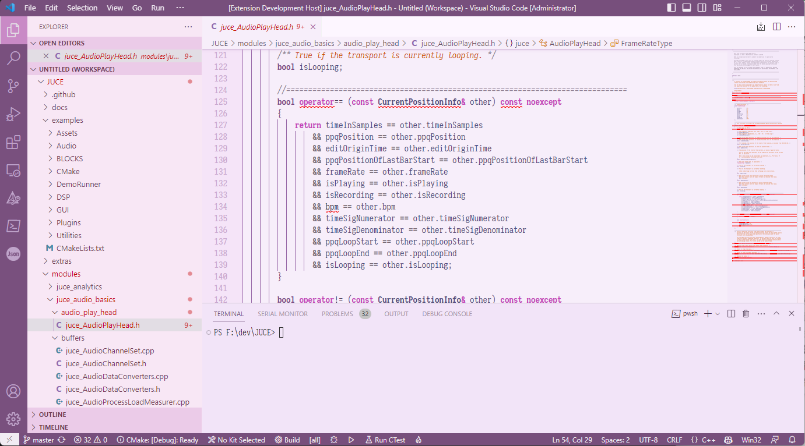

# Yuduki (light)

A light colour theme for VS Code based on Yuduki Yukari (結月ゆかり). Sometimes transcribed as Yu**z**uki Yukari as well.  

Much purple, very Yukari, wow.  

## Screenshot

## Usage

Go to [release](https://github.com/Schmeichel20/yuduki-colour-light/releases) and grab the latest VSIX package.  

If you want to use it WIP, refer to [the Microsoft documentation](https://code.visualstudio.com/api/extension-guides/color-theme) (and related pages) on how to use an unpacked VS code colour theme.  

Currently I have no plans of publishing this to the official VSC extension marketplace. Maybe I will at a later date.